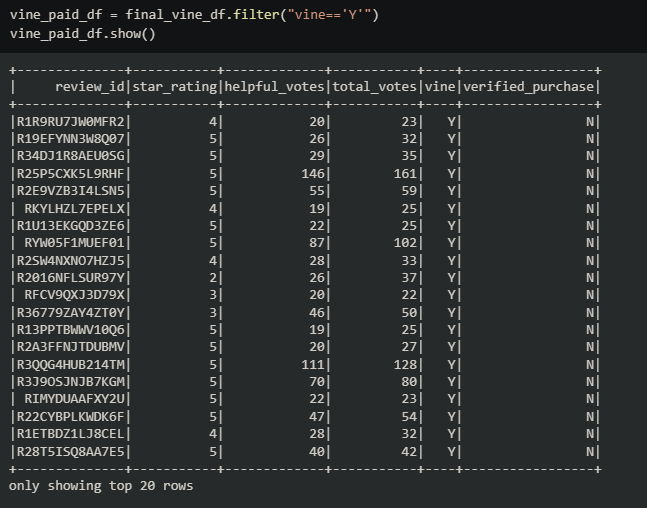
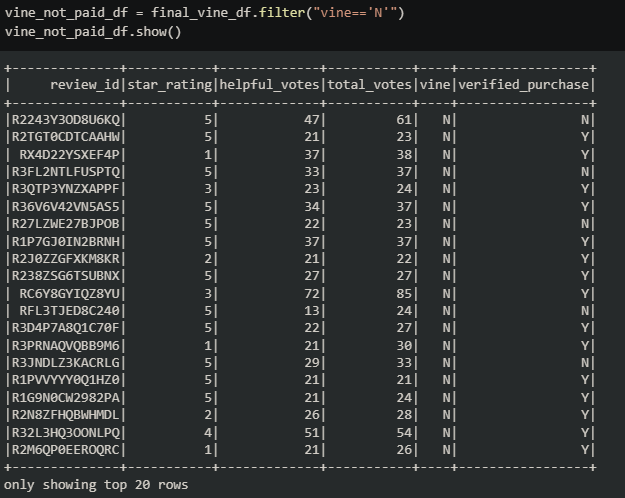
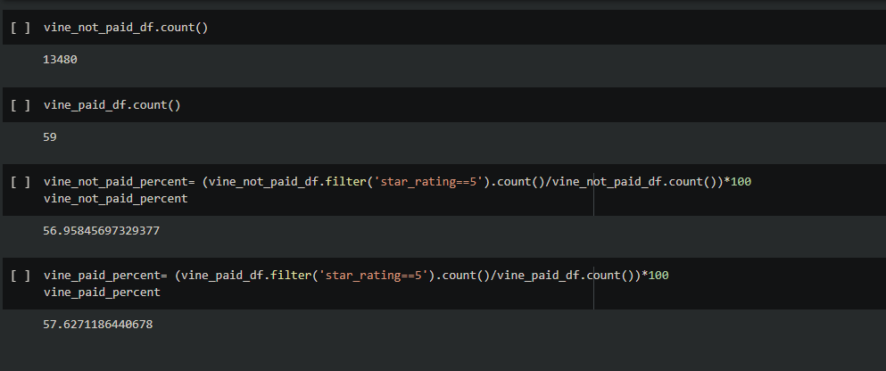

# Amazon-Vine-Analysis
## Overview of Vine program
The purpose of this analysis was to split amazon review data into two categories: those that are a part of the Amazon vine program (paid) and those that aren't

1. Paid

 

versus 

2. Not paid

From there, we compared the percentage of 5 star ratings being given by vine program reviewers vs normal users of Amazon. I found that there isn't a huge percentage difference in 5 star ratings being given out by paid or unpaid reviewers.

This figure above shows that there were 13,480 reviewers for musical instruments on Amazon and 59 that were a part of Amazon's Vine program. The percentage of 5 star reviews per total reviews between both groups is only 1% different. From this we can conclude that if the pattern continues, paid reviewers aren't any more likely to give out 5 star reviews. 

There were only 59 paid reviews for musical instruments compared to a much larger sample size of unpaid reviews. This is a potential limitation of the dataset.